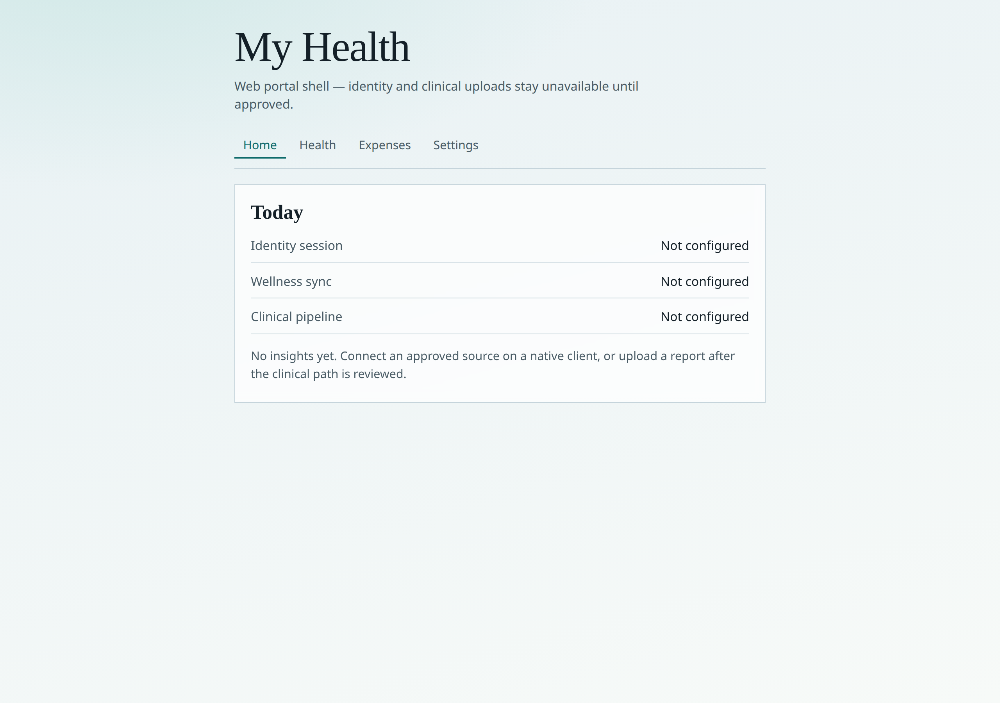
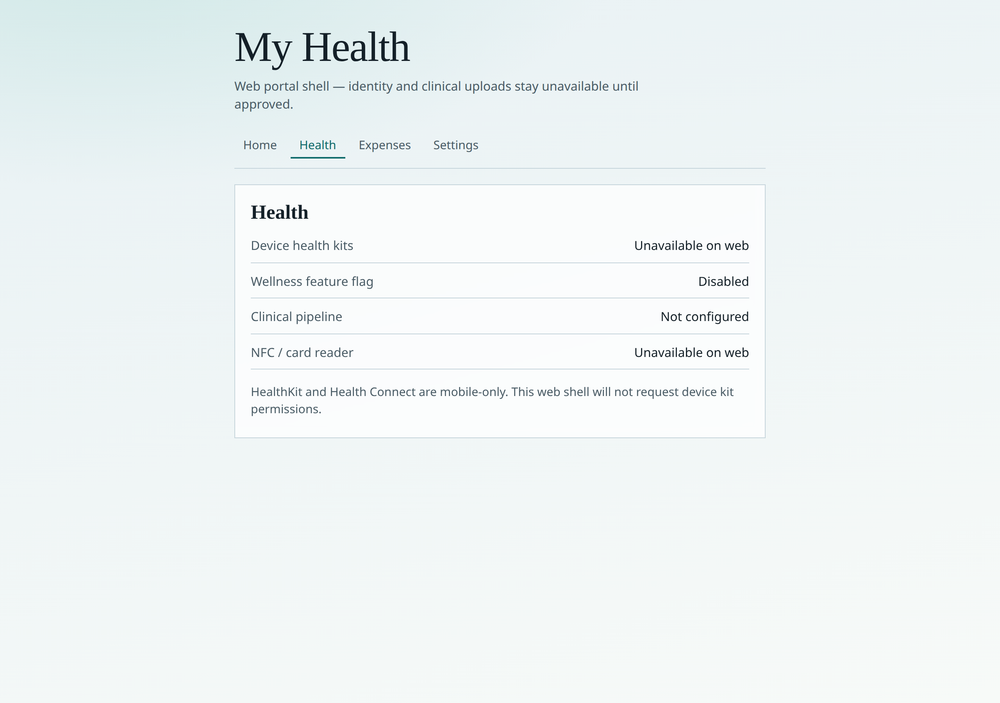
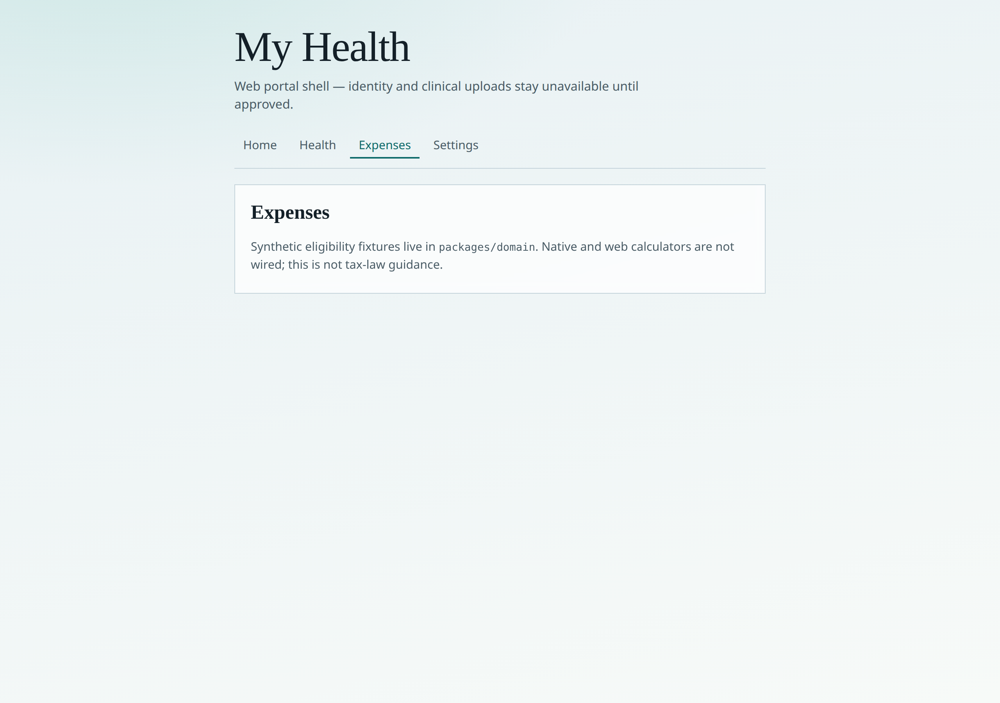
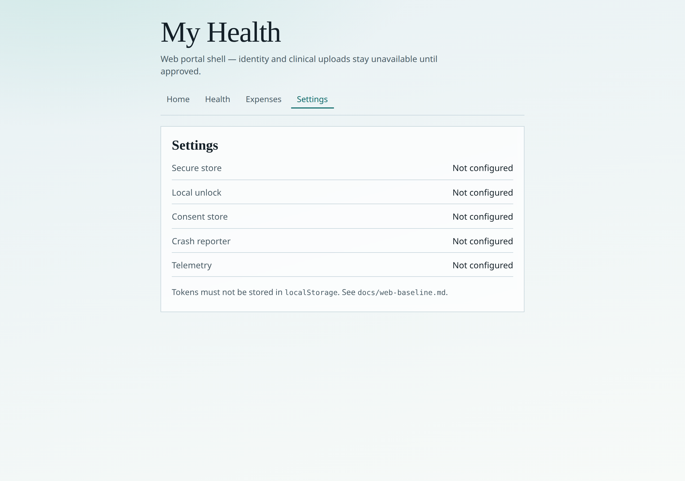

# Web portal screens

Screenshots of the fail-closed `apps/web` shell (Vite + React). Identity, clinical upload, and device kits are not wired. Regenerated with `node scripts/capture-web-screenshots.mjs` while `pnpm --filter @health-app/web preview` is running.

Related: [web-baseline.md](web-baseline.md) · [STACK.md](STACK.md) · [`apps/web/README.md`](../apps/web/README.md)

---

## Home

Status strip for identity, wellness sync, and clinical pipeline — all **Not configured**.

## Health

Device health kits and NFC are **Unavailable on web**. Wellness feature flag remains **Disabled**.

## Expenses

Placeholder pointing at synthetic fixtures in `packages/domain` (not tax-law guidance).

## Settings

Secure store, local unlock, consent, crash reporter, and telemetry — all **Not configured**. Tokens must not use `localStorage`.

---

*Captured 2026-09-30 from the local production preview build.*
